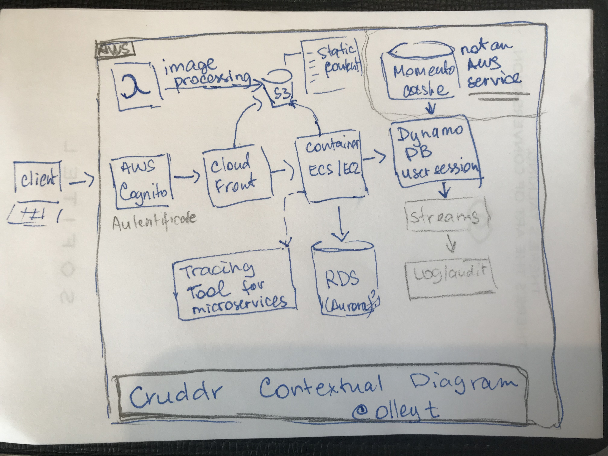
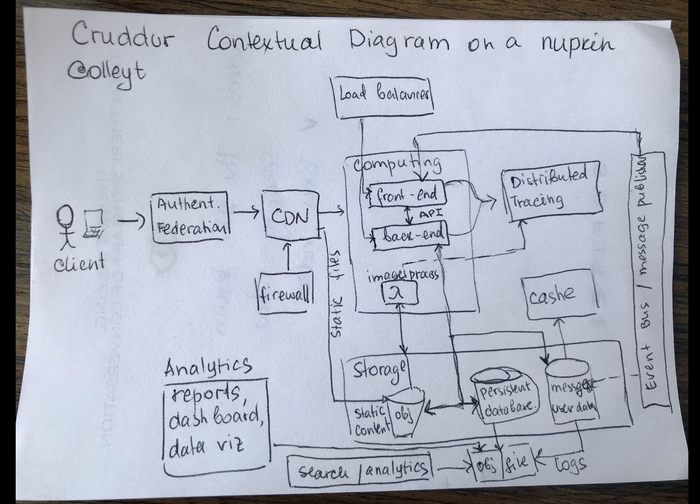
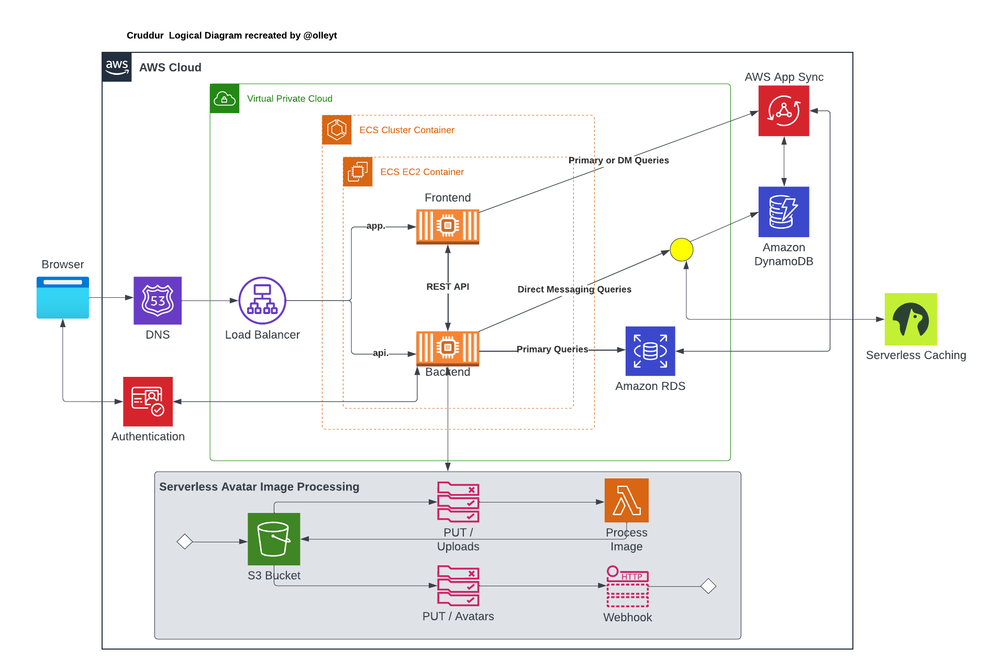
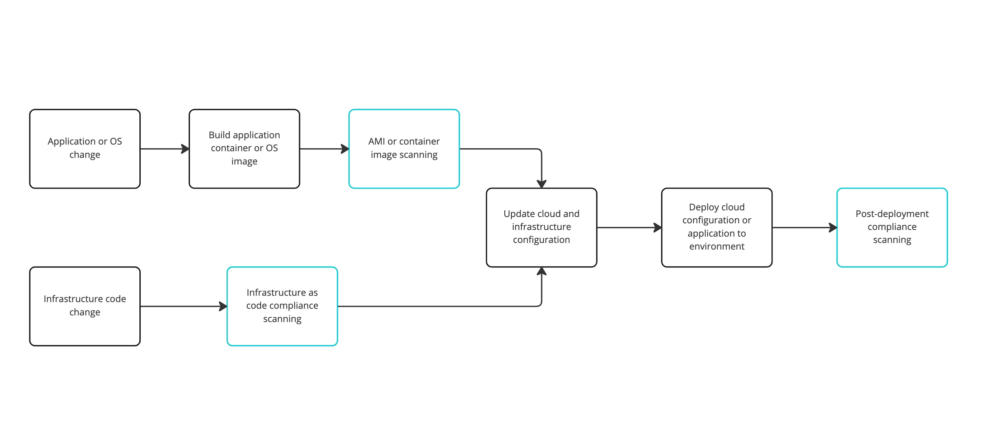
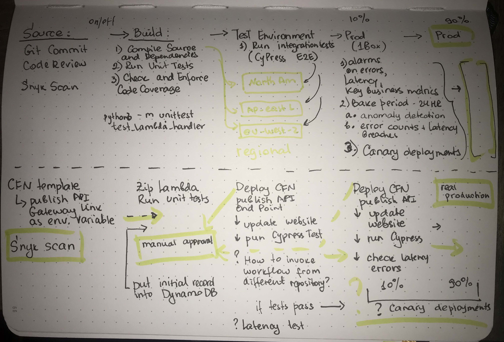

# Week 0 — Billing and Architecture

## Introduction
This week will reflect on:
* understanding Cruddr investors needs, 
* what do they want to build
* what are the technical and budget constraints 
* contextual and logical design for the app
* setting up AWS account, users and groups, OUs,and access outside of AWS for GitPod environments.
* as there is a budget constraint to keep the budget to minimum and as a best practice, AWS budgets and CloudWatch alarms need to be created to track spending

## Initial design

It was important to understand what Cruddr is envisioned to be and what constraints are in place before choosing specific AWS services. 
For example, budget constraint to keep cost near $0 impacts how computing layer will be designed as not all AWS services such as Fargate have free tier.


### Contextual Diagram
As a solutions architect, I sketched a conceptual diagram on the napkin during first meeting with Cruddr investors (all right, it was part of the Week 0 lesson video).


Ouch; as I progressed through the video, I've learned that napkin design shall not include specific services / technologies mentioned yet. That shall be depicted on a logical architecture diagram.

This is another version of the conceptual diagram on a napkin in a more abstracted way: 


## Logical Diagram

The logical diagram was discusses during the class, however as diagramming practice we were tasked to recreated it.
What can I say, working with LucidChart is a breeze, and I enjoyed this task. LucidChart is a lot easier to use compared to MS Visio and even Miro!

Here is my digram after I spent ~30 mins on it:

This diagram is also accessible [here](https://lucid.app/lucidchart/4c21c5b9-51ae-4f6a-adab-1a8b6e42e715/edit?viewport_loc=-165%2C-39%2C2020%2C1090%2C0_0&invitationId=inv_4b9cba84-fd8d-4120-924f-7fea3f65b42f)


## CI/CD Pipeline
This is the starting point for CI/CD pipeline as I see it for the Cruddur application



I also depicted a more detailed CI/CD pipeline inspired by 'Be a better Dev' YouTube video 'Ideal Pipeline':



## Congiguring GitPod

### Installing AWS CLI
The task below will install AWS CLI each time GitPod spins up an environment.
The task code was copied from Andrew's blog for week0:
```
tasks:
  - name: aws-cli
    env:
      AWS_CLI_AUTO_PROMPT: on-partial
    init: |
      cd /workspace
      curl "https://awscli.amazonaws.com/awscli-exe-linux-x86_64.zip" -o "awscliv2.zip"
      unzip awscliv2.zip
      sudo ./aws/install
      cd $THEIA_WORKSPACE_ROOT
```
