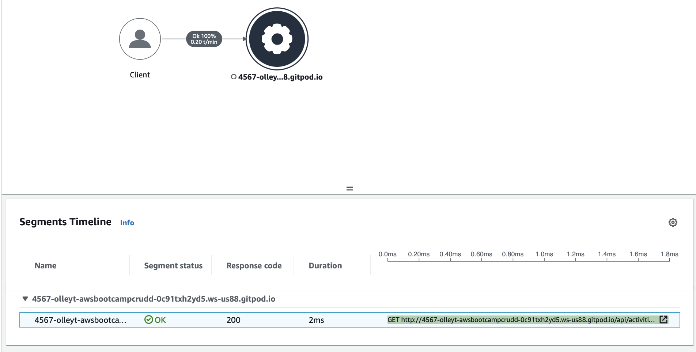
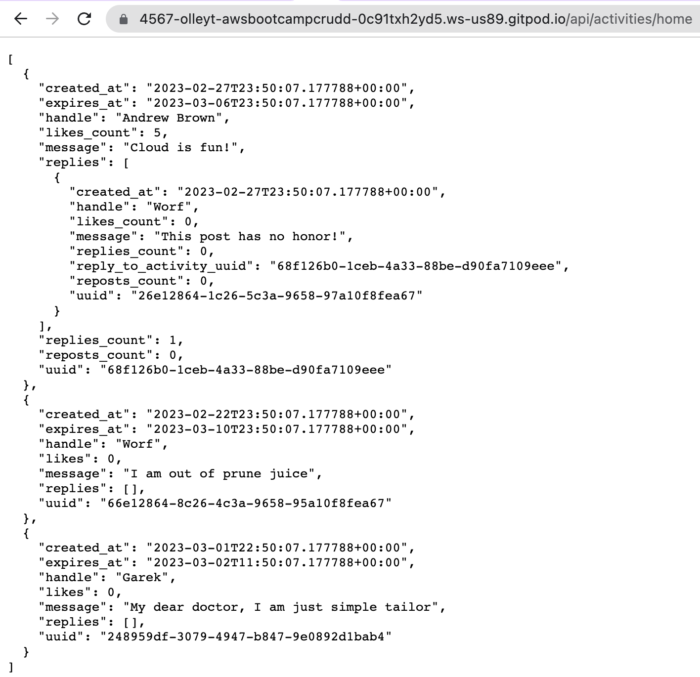
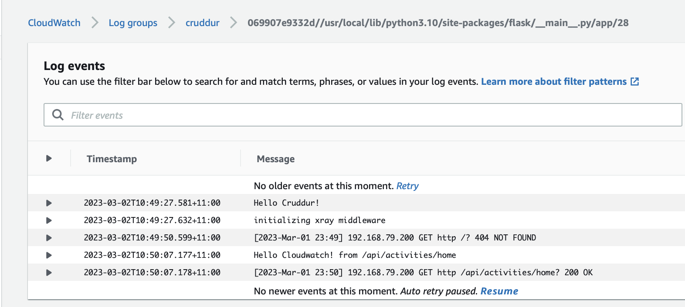
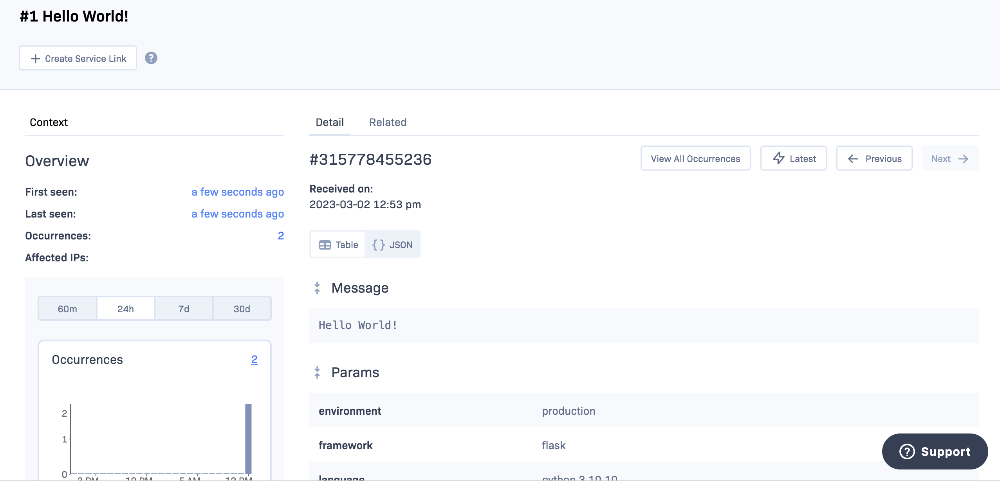
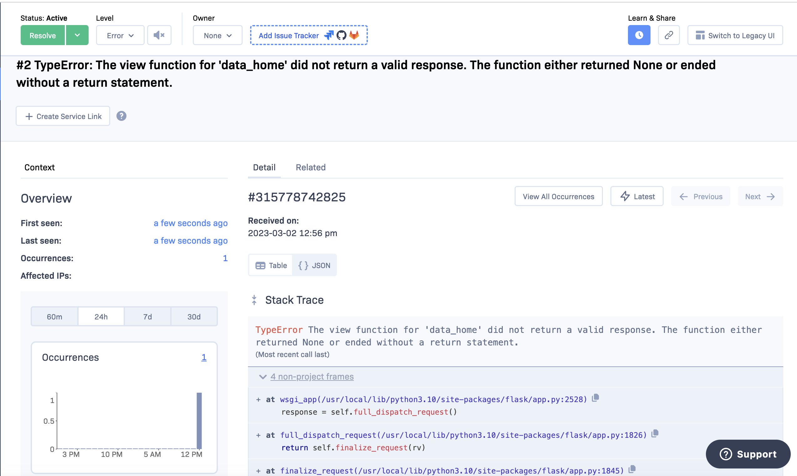
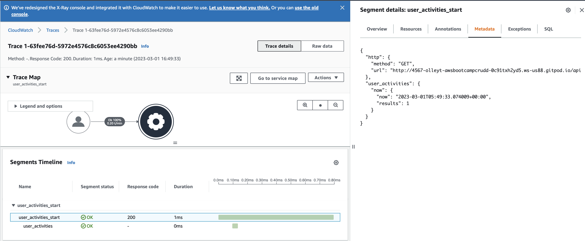

# Week 2 — Distributed Tracing

## Completed Required Homework
1. [HoneyComb](#honeycomb)
2. [Tagging week2 work](#tagging-week-2-work)
3. [XRay](#xray)
4. [CloudWatch Logs](#cloudwatch-logs)
5. [Rollbar](#rollbar)
6. [Stretch Challenges](#stretch-challenges)
7. [Career Homework](#career-homework)
8. Watched Security Considerations and completed security quiz


## HoneyComb

### Instrumented Honeycomb with OTEL
As I watched [Lesson on HoneyComb], the following steps were completed:
1. created an anvironment for cruddur
2. set HoneyComb API keys as GitPod environment variables: 
```bash
export HONEYCOMB_API_KEY=""
export HONEYCOMB_SERVICE_NAME="Cruddur"
gp env HONEYCOMB_API_KEY=""
gp env HONEYCOMB_SERVICE_NAME="Cruddur"
```
3. However, Jessica advised to set honeycomb service name in docker-compose file uniquely for each service instead.
Hence, I unset HONEYCOMB_SERVICE_NAME like so:
``` unset HONEYCOMB_SERVICE_NAME ```

4. Then as per the class instructions, these OTEL (open telemetry) variables were added to docker compose for back-end service:
```bash
OTEL_EXPORTER_OTLP_ENDPOINT: "https://api.honeycomb.io"
OTEL_EXPORTER_OTLP_HEADERS: "x-honeycomb-team=${HONEYCOMB_API_KEY}"
OTEL_SERVICE_NAME: "backend-flask"
```
5. Added open telemetry libraries to ```requirements.txt```
```
opentelemetry-api 
opentelemetry-sdk 
opentelemetry-exporter-otlp-proto-http 
opentelemetry-instrumentation-flask 
opentelemetry-instrumentation-requests
```
6. Added these lines in backend-flask/app.py
```
from opentelemetry import trace
from opentelemetry.instrumentation.flask import FlaskInstrumentor
from opentelemetry.instrumentation.requests import RequestsInstrumentor
from opentelemetry.exporter.otlp.proto.http.trace_exporter import OTLPSpanExporter
from opentelemetry.sdk.trace import TracerProvider
from opentelemetry.sdk.trace.export import BatchSpanProcessor
```
7. Then added a tracer for a new span for home activities following [HoneyComb documentation](https://docs.honeycomb.io/getting-data-in/opentelemetry/python/) and live stream between 1hr:25min and 1hr:34min.
8. Next I ran custom query grouped by trace.trace_id and chose a trace with 2 spans and evidenced that trace has expected custom attributes. 

9. Following instructions from Jessica, I learnt how to create a heatmap on duration(ms) for 90 percentile of requests and how to zoom in on the visialisation for a particular time frame


   
### Further Learning on HoneyComb  
  Insightful notes from Jessica:
  * Honeycomb is not in our cloud environment, rather our cloud environment sends data to HoneyComb.
  * We can customise WHERE clause. For example, we can add condition app.result exists and then chose spans with max(app.result).
  
  Insightful note from Andrew:
  Open Cloud Foundation and Open Telemetry project are worth exploring further.

## Tagging Week 2 work:
created tag: ```git tag -a week2 -m "my week-2 commits"```
pushed tag: ```git push origin week2```

However, the tag shall be added after week 2 finished, so I would need to rename this tag:
```bash
git tag week2-start week2
git tag -d week2
git push origin new :week2
```   
result:
```bash
Total 0 (delta 0), reused 0 (delta 0), pack-reused 0
To https://github.com/olleyt/aws-bootcamp-cruddur-2023.git
 - [deleted]         week2
 * [new tag]         week2-start -> week2-start
gitpod /workspace/aws-bootcamp-cruddur-2023 (main) $ 
```
## XRay

Following along Andrew's instructions, these changes were impleneted:
1. added ```aws-xray-sdk``` into backend-flask/requirements.txt
2. installed Python dependencies: 
```bash
cd backend-flask
pip install -r requirements.tx
```
3. Added the following lines in backend-flask/app.py
```python
from aws_xray_sdk.core import xray_recorder
from aws_xray_sdk.ext.flask.middleware import XRayMiddleware

xray_url = os.getenv("AWS_XRAY_URL")
xray_recorder.configure(service='backend-flask', dynamic_naming=xray_url)
XRayMiddleware(app, xray_recorder)
```
4. added aws/json/xray.json for sampling data
```json
{
  "SamplingRule": {
      "RuleName": "Cruddur",
      "ResourceARN": "*",
      "Priority": 9000,
      "FixedRate": 0.1,
      "ReservoirSize": 5,
      "ServiceName": "Cruddur",
      "ServiceType": "*",
      "Host": "*",
      "HTTPMethod": "*",
      "URLPath": "*",
      "Version": 1
  }
}
```
5. added new policy to give access to X-Ray to my AWS CLI user
6. added X-Ray group:
```
aws xray create-group \
   --group-name "Cruddur" \
   --filter-expression "service(\"backend-flask\")"
```
got response:
```bash
gitpod /workspace/aws-bootcamp-cruddur-2023/backend-flask (main) $ aws xray create-group    --group-name "Cruddur"    --filter-expression "service(\"backend-flask\")"
{
    "Group": {
        "GroupName": "Cruddur",
        "GroupARN": "arn:aws:xray:us-east-1:<ACCOUNT_ID>:group/Cruddur/<GROUP_ID>",
        "FilterExpression": "service(\"backend-flask\")",
        "InsightsConfiguration": {
            "InsightsEnabled": false,
            "NotificationsEnabled": false
        }
    }
}
```
7. verified that X-Ray group was created:

8. created sampling rule with this command: 
```bash
aws xray create-sampling-rule --cli-input-json file://aws/json/xray.json
```
9. added X-Ray daemon to docker-compose.yml:
```yml
  xray-daemon:
    image: "amazon/aws-xray-daemon"
    environment:
      AWS_ACCESS_KEY_ID: "${AWS_ACCESS_KEY_ID}"
      AWS_SECRET_ACCESS_KEY: "${AWS_SECRET_ACCESS_KEY}"
      AWS_REGION: "us-east-1"
    command:
      - "xray -o -b xray-daemon:2000"
    ports:
      - 2000:2000/udp
```
10. moved line ```XRayMiddleware(app, xray_recorder)``` after the app was defined in backend-flask/app.py
11. ran docker compose up
12. evidenced in doscker container for X-Ray logs that segment was sent to X-Ray:
```bash
2023-03-01T00:18:19Z [Info] HTTP Proxy server using X-Ray Endpoint : https://xray.us-east-1.amazonaws.com
2023-03-01T00:18:19Z [Info] Starting proxy http server on 0.0.0.0:2000
2023-03-01T00:20:54Z [Info] Successfully sent batch of 1 segments (1.104 seconds)
2023-03-01T00:20:59Z [Info] Successfully sent batch of 1 segments (0.085 seconds)
2023-03-01T00:31:13Z [Info] Successfully sent batch of 1 segments (0.087 seconds)
2023-03-01T00:33:10Z [Info] Successfully sent batch of 1 segments (0.082 seconds)
2023-03-01T00:33:11Z [Info] Successfully sent batch of 1 segments (0.086 seconds)
```
13. evidenced that X-Ray trace appeared in AWS X-Ray console when clicked on Traces:



## CloudWatch Logs
Following the official instructions, completed homework without issues.
All code changes can be seen in this [commit](https://github.com/olleyt/aws-bootcamp-cruddur-2023/commit/11ee3113e59d36f8ab8ab2e9c45a962f8aea4945) 

Same changes discussed in details below to add context why they were introduced:
### Libraries Setup
1. added watchtower lib in backend-flask/requirements.txt: 
```
watchtower
```
2. run the following command in the terminal:
```bash
pip install -r requirements.txt
```
### app.py
3. made changes to backend-flask/app.py:
3.1. added these libraries to import section at the top:
```python
import watchtower
import logging
from time import strftime
```
3.2. added lines before HoneyComb tracing (lines 29-43)
```python
# Configuring Logger to Use CloudWatch
LOGGER = logging.getLogger(__name__)
LOGGER.setLevel(logging.DEBUG)
console_handler = logging.StreamHandler()
cw_handler = watchtower.CloudWatchLogHandler(log_group='cruddur')
LOGGER.addHandler(console_handler)
LOGGER.addHandler(cw_handler)
LOGGER.info("Hello Cruddur!")
```
3.3. added logging after each request in lines 73-78:
```python
@app.after_request
def after_request(response):
    timestamp = strftime('[%Y-%b-%d %H:%M]')
    LOGGER.error('%s %s %s %s %s %s', timestamp, request.remote_addr, request.method, request.scheme, request.full_path, response.status)
    return response
```
3.4. passed logger to run function for home activities (line 116)
```python  
  data = HomeActivities.run(logger=LOGGER)
```
### Changes to home_activities.py
Changed run function to accept logger parameter and added a test logging message (lines 7-8):
```python
def run(logger):
    logger.info('Hello Cloudwatch! from  /api/activities/home')
```
### Changes to docker-compose.yml
Added following environmental variables for CloudWatch logging in lines 12-14
```yml
      AWS_DEFAULT_REGION: "${AWS_DEFAULT_REGION}"
      AWS_ACCESS_KEY_ID: "${AWS_ACCESS_KEY_ID}"
      AWS_SECRET_ACCESS_KEY: "${AWS_SECRET_ACCESS_KEY}"
```
### New IAM Policy for CloudWatch
As I continue to follow the principle of least priviledge, new policy ```cruddur_cloudwatch_dev_policy``` was created and attached to my development AWS user:
```json
{
    "Version": "2012-10-17",
    "Statement": [
        {
            "Sid": "VisualEditor0",
            "Effect": "Allow",
            "Action": [
                "logs:GetLogEvents",
                "logs:PutLogEvents"
            ],
            "Resource": [
                "arn:aws:logs:us-east-1:<ACCOUNT_ID>:log-group:cruddur:log-stream:*",
                "arn:aws:logs:*:*:log-group:/aws/*/*:log-stream:*"
            ]
        },
        {
            "Sid": "VisualEditor1",
            "Effect": "Allow",
            "Action": [
                "logs:CreateLogStream",
                "logs:DescribeLogStreams",
                "logs:PutRetentionPolicy",
                "logs:CreateLogGroup"
            ],
            "Resource": [
                "arn:aws:logs:us-east-1:<ACCOUNT_ID>:log-group:cruddur:log-stream:*",
                "arn:aws:logs:*:*:log-group:/aws/*/*:log-stream:*"
            ]
        }
    ]
}
```
### Ran Docker Compose & Evidenced CloudWatch Logging
As a quick test that CloudWatch logging works as expected, I completed following steps:
1. ran docker compose up
2. accessed home activities endpoint and got a valid response:

3. acessed CloudWatch console and evidenced that both messages from app.py and home_activities.py are present in the log:


## Rollbar
Rollbar is a troubleshooting and debugging cloud tool that I hope will help me to analyse errors, especially when documentation for X-Ray SDK is so limited.
### Rollbar Setup
Steps completed for Rollbar enabling also seen in this [commit](https://github.com/olleyt/aws-bootcamp-cruddur-2023/commit/ed60b7d07c191fc9ef661d5a6fd41275e6127b30):
1. Added blinker and rollbar libraries to backedn-flask/requirements.txt:
```
blinker
rollbar
```
2. ran pip install in the terminal:
```sh
pip install -r requirements.txt
```
3. acquired token from Rollbar setup page and set it as an environment variable in the terminal: 
```bash
export ROLLBAR_ACCESS_TOKEN=""
gp env ROLLBAR_ACCESS_TOKEN=""
```
4. added `ROLLBAR_ACCESS_TOKEN` enviroment variable to backend-flask service in `docker-compose.yml`

```yml
ROLLBAR_ACCESS_TOKEN: "${ROLLBAR_ACCESS_TOKEN}"
```
### Code Changes

5. Completed code changes in backend-flask/app.py for Rollbar instrumentation:

5.1. imported required libraries
```py
import rollbar
import rollbar.contrib.flask
from flask import got_request_exception
```
5.2. set up a Rollbar listener:
```py
rollbar_access_token = os.getenv('ROLLBAR_ACCESS_TOKEN')
@app.before_first_request
def init_rollbar():
    """init rollbar module"""
    rollbar.init(
        # access token
        rollbar_access_token,
        # environment name
        'production',
        # server root directory, makes tracebacks prettier
        root=os.path.dirname(os.path.realpath(__file__)),
        # flask already sets up logging
        allow_logging_basic_config=False)

    # send exceptions from `app` to rollbar, using flask's signal system.
    got_request_exception.connect(rollbar.contrib.flask.report_exception, app)
```
5.3. added a test endpoint for Rollbar:
```py
@app.route('/rollbar/test')
def rollbar_test():
    rollbar.report_message('Hello World!', 'warning')
    return "Hello World!"
```
5.4. hit endpoint from the backend and got the message as expected:

5.5.logged in Rollbar, went to items and found warnings recorded:
 

### Rollbar Test on Error
Followed Andrew's instructions from the video
1. Followed along the video instructions and deleted `return` word at the end of backend-flask/home_activities.py
2. hit the endpont from the back-end service by appending url with `/api/activities/home`
3. got an error in the browser
4. switched back to Rollbar and evidenced that the error and stack trace were recorded:
 
5. reverted the code change in backend-flask/home_activities.py   

## Stretch Challenges

### HoneyComb Save Queries
- saved the query created during the class: [Heatmap saved query](../_docs/assets/honeycomb_heatmap_saved_query.png)

### X-Ray Subsegments
The main challenge here was figuring out how to pass context and xray recorder and request details to a backend service that is implemented in a separate script in its own class.

I also wrote an [article](https://olley.hashnode.dev/aws-free-cloud-bootcamp-instrumenting-aws-x-ray-subsegments) about this challenge.

I chose to complete the challenge on user_activities.py

The steps required for enabling segment and subsegments on this service:
1. in the app.py:
1.1.  lines 104-111, change the data_handle function to create user_activities instance of UserActivities class explicitly.
1.2.  pass xray_recorder, request as input values to constructor so that xray recorder will be propagated and available for the user_activities run function:
```python
def data_handle(handle):
# changes start ----->
  user_activities = UserActivities(xray_recorder, request)
  model = user_activities.run(handle)
# changes end <------    
  if model['errors'] is not None:
    return model['errors'], 422
  else:
    return model['data'], 200
```
2. in services/user_activities.py:
2.1.  create constructor with __init__ method:
```python
def __init__(self, xray_recorder, request):
        self.xray_recorder = xray_recorder
        self.request = request
```
2.2. change run function to create a segment inside try - fnally block as closing segment is important for the trace to be sent to X-Ray
```python
def run(self, user_handle):
    try:
      # Start a segment
      segment = self.xray_recorder.begin_segment('user_activities_start')
      segment.put_annotation('url', self.request.url)
      model = {
        'errors': None,
        'data': None
      }

      now = datetime.now(timezone.utc).astimezone()
      # Add metadata or annotation here if necessary
      xray_dict = {'now': now.isoformat()}
      segment.put_metadata('now', xray_dict, 'user_activities')
      segment.put_metadata('method', self.request.method, 'http')
      segment.put_metadata('url', self.request.url, 'http')
      if user_handle == None or len(user_handle) < 1:
        model['errors'] = ['blank_user_handle']
      else:
        # Start a subsegment
        subsegment = self.xray_recorder.begin_subsegment('user_activities_nested_subsegment')
        now = datetime.now()
        results = [{
          'uuid': '248959df-3079-4947-b847-9e0892d1bab4',
          'handle':  'Andrew Brown',
          'message': 'Cloud is fun!',
          'created_at': (now - timedelta(days=1)).isoformat(),
          'expires_at': (now + timedelta(days=31)).isoformat()
        }]
        model['data'] = results
        xray_dict['results'] = len(model['data'])
        subsegment.put_metadata('results', xray_dict, 'user_activities')
    finally:  
      # Close the segment
      self.xray_recorder.end_subsegment()
    return model
```
*Note:* the trace has no clear labels on the trace visiual, but when clicking on Raw Data or segments on the timeline, metadata and annotations provide necessary information.
This is the trace example for user_activities.py service that was called via back-end by appending the link with ```/api/activities/@andrewbrown```:



## Career Homework

### Lou's template completed
*I am good at:*
* designing new solutions, seeing potential for automation
* version control
* troubleshooting and debugging
* Python
* learning new technologies
* helping and guiding others to overcome their struggles
* stakeholder management, liasing with technical and non-technical audiences
* presentation, diagraming
* documentating how-to guides, operational procedures

Given my talents and participation in the AWS Community Builder Program (Machine Learning) I think Cloud Engineer shall be my target role with progression to MLOps / machine learning engineer.

Hence:
| I will know      | I will not get distracted by | 
| :---          |    :----:    | 
| Python       | Social Media               |
| AWS (broadly) | Comparing myself to others | 
| SageMaker     | Web Development           |
| DeepLearning Fundamentals | Terraform |
| Containers                | Linux system administration, Ansible|

In addition:
* I have applied to 4 Cloud Engineer roles and also for bootcamp placement my mentor recommened.
* I have combatted fear of rejection and messaged to the company from whom I have never received feedback on my application
