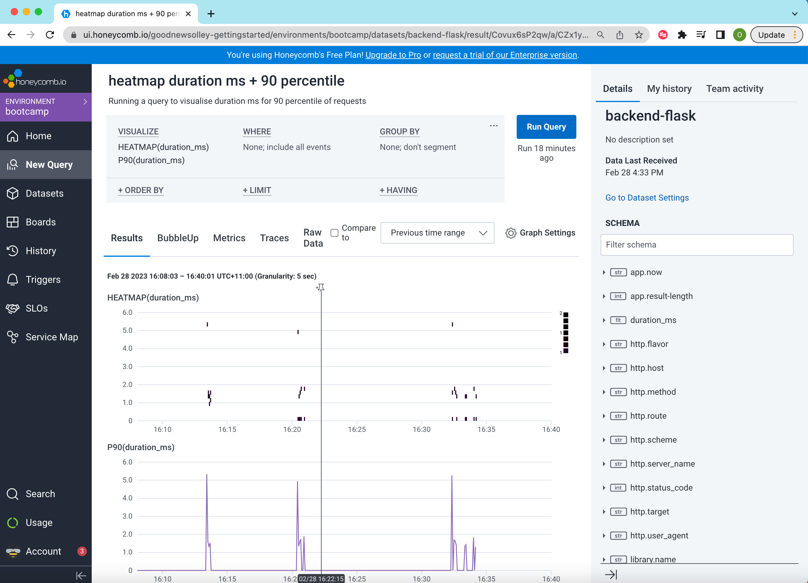
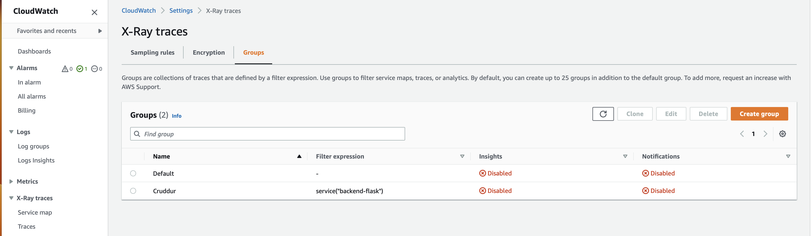

# Week 2 — Distributed Tracing

## Completed Required Homework
1. [HoneyComb](#honeycomb)
2. [Tagging week2 work](#tagging-week-2-work)
3. [XRay](#xray)

## HoneyComb

### Instrumented Honeycomb with OTEL
As I watched [Lesson on HoneyComb], the following steps were completed:
1. created an anvironment for cruddur
2. set HoneyComb API keys as GitPod environment variables: 
```bash
export HONEYCOMB_API_KEY=""
export HONEYCOMB_SERVICE_NAME="Cruddur"
gp env HONEYCOMB_API_KEY=""
gp env HONEYCOMB_SERVICE_NAME="Cruddur"
```
3. However, Jessica advised to set honeycomb service name in docker-compose file uniquely for each service instead.
Hence, I unset HONEYCOMB_SERVICE_NAME like so:
``` unset HONEYCOMB_SERVICE_NAME ```

4. Then as per the class instructions, these OTEL (open telemetry) variables were added to docker compose for back-end service:
```bash
OTEL_EXPORTER_OTLP_ENDPOINT: "https://api.honeycomb.io"
OTEL_EXPORTER_OTLP_HEADERS: "x-honeycomb-team=${HONEYCOMB_API_KEY}"
OTEL_SERVICE_NAME: "backend-flask"
```
5. Added open telemetry libraries to ```requirements.txt```
```
opentelemetry-api 
opentelemetry-sdk 
opentelemetry-exporter-otlp-proto-http 
opentelemetry-instrumentation-flask 
opentelemetry-instrumentation-requests
```
6. Added these lines in backend-flask/app.py
```
from opentelemetry import trace
from opentelemetry.instrumentation.flask import FlaskInstrumentor
from opentelemetry.instrumentation.requests import RequestsInstrumentor
from opentelemetry.exporter.otlp.proto.http.trace_exporter import OTLPSpanExporter
from opentelemetry.sdk.trace import TracerProvider
from opentelemetry.sdk.trace.export import BatchSpanProcessor
```
7. Then added a tracer for a new span for home activities following [HoneyComb documentation](https://docs.honeycomb.io/getting-data-in/opentelemetry/python/) and live stream between 1hr:25min and 1hr:34min.
8. Next I ran custom query grouped by trace.trace_id and chose a trace with 2 spans and evidenced that trace has expected custom attributes. 

9. Following instructions from Jessica, I learnt how to create a heatmap on duration(ms) for 90 percentile of requests and how to zoom in on the visialisation for a particular time frame


   
### Further Learning on HoneyComb  
  Insightful notes from Jessica:
  * Honeycomb is not in our cloud environment, rather our cloud environment sends data to HoneyComb.
  * We can customise WHERE clause. For example, we can add condition app.result exists and then chose spans with max(app.result).
  
  Insightful note from Andrew:
  Open Cloud Foundation and Open Telemetry project are worth exploring further.

## Tagging Week 2 work:
created tag: ```git tag -a week2 -m "my week-2 commits"```
pushed tag: ```git push origin week2```

However, the tag shall be added after week 2 finished, so I would need to rename this tag:
```bash
git tag week2-start week2
git tag -d week2
git push origin new :week2
```   
result:
```bash
Total 0 (delta 0), reused 0 (delta 0), pack-reused 0
To https://github.com/olleyt/aws-bootcamp-cruddur-2023.git
 - [deleted]         week2
 * [new tag]         week2-start -> week2-start
gitpod /workspace/aws-bootcamp-cruddur-2023 (main) $ 
```
## XRay

Following along Andrew's instructions, these changes were impleneted:
1. added ```aws-xray-sdk``` into backend-flask/requirements.txt
2. installed Python dependencies: 
```bash
cd backend-flask
pip install -r requirements.tx
```
3. Added the following lines in backend-flask/app.py
```python
from aws_xray_sdk.core import xray_recorder
from aws_xray_sdk.ext.flask.middleware import XRayMiddleware

xray_url = os.getenv("AWS_XRAY_URL")
xray_recorder.configure(service='backend-flask', dynamic_naming=xray_url)
XRayMiddleware(app, xray_recorder)
```
4. added aws/json/xray.json for sampling data
```json
{
  "SamplingRule": {
      "RuleName": "Cruddur",
      "ResourceARN": "*",
      "Priority": 9000,
      "FixedRate": 0.1,
      "ReservoirSize": 5,
      "ServiceName": "Cruddur",
      "ServiceType": "*",
      "Host": "*",
      "HTTPMethod": "*",
      "URLPath": "*",
      "Version": 1
  }
}
```
5. added new policy to give access to X-Ray to my AWS CLI user
6. added X-Ray group:
```
aws xray create-group \
   --group-name "Cruddur" \
   --filter-expression "service(\"backend-flask\")"
```
got response:
```bash
gitpod /workspace/aws-bootcamp-cruddur-2023/backend-flask (main) $ aws xray create-group    --group-name "Cruddur"    --filter-expression "service(\"backend-flask\")"
{
    "Group": {
        "GroupName": "Cruddur",
        "GroupARN": "arn:aws:xray:us-east-1:<ACCOUNT_ID>:group/Cruddur/<GROUP_ID>",
        "FilterExpression": "service(\"backend-flask\")",
        "InsightsConfiguration": {
            "InsightsEnabled": false,
            "NotificationsEnabled": false
        }
    }
}
```
7. verified that X-Ray group was created:

8. created sampling rule with this command: 
```bash
aws xray create-sampling-rule --cli-input-json file://aws/json/xray.json
```
9. added X-Ray daemon to docker-compose.yml:
```yml
  xray-daemon:
    image: "amazon/aws-xray-daemon"
    environment:
      AWS_ACCESS_KEY_ID: "${AWS_ACCESS_KEY_ID}"
      AWS_SECRET_ACCESS_KEY: "${AWS_SECRET_ACCESS_KEY}"
      AWS_REGION: "us-east-1"
    command:
      - "xray -o -b xray-daemon:2000"
    ports:
      - 2000:2000/udp
```
10. moved line ```XRayMiddleware(app, xray_recorder)``` after the app was defined in backend-flask/app.py
11. ran docker compose up
12. evidenced in doscker container for X-Ray logs that segment was sent to X-Ray:
```bash
2023-03-01T00:18:19Z [Info] HTTP Proxy server using X-Ray Endpoint : https://xray.us-east-1.amazonaws.com
2023-03-01T00:18:19Z [Info] Starting proxy http server on 0.0.0.0:2000
2023-03-01T00:20:54Z [Info] Successfully sent batch of 1 segments (1.104 seconds)
2023-03-01T00:20:59Z [Info] Successfully sent batch of 1 segments (0.085 seconds)
2023-03-01T00:31:13Z [Info] Successfully sent batch of 1 segments (0.087 seconds)
2023-03-01T00:33:10Z [Info] Successfully sent batch of 1 segments (0.082 seconds)
2023-03-01T00:33:11Z [Info] Successfully sent batch of 1 segments (0.086 seconds)
```
13. evidenced that X-Ray trace appeared in AWS X-Ray console when clicked on Traces:


## Stretch Challenges
- saved the query created during the class: [Heatmap saved query](../_docs/assets/honeycomb_heatmap_saved_query.png)

## Career Homework

### Lou's template completed
*I am good at:*
* designing new solutions, seeing potential for automation
* version control
* troubleshooting and debugging
* Python
* learning new technologies
* helping and guiding others to overcome their struggles
* stakeholder management, liasing with technical and non-technical audiences
* presentation, diagraming
* documentating how-to guides, operational procedures

Given my talents and participation in the AWS Community Builder Program (Machine Learning) I think Cloud Engineer shall be my target role with progression to MLOps / machine learning engineer.

Hence:
| I will know      | I will not get distracted by | 
| :---          |    :----:    | 
| Python       | Social Media               |
| AWS (broadly) | Comparing myself to others | 
| SageMaker     | Web Development           |
| DeepLearning Fundamentals | Terraform |
| Containers                | Linux system administration, Ansible|

In addition:
* I have applied to 4 Cloud Engineer roles and also for bootcamp placement my mentor recommened.
* I have combatted fear of rejection and messaged to the company from whom I have never received feedback on my application
